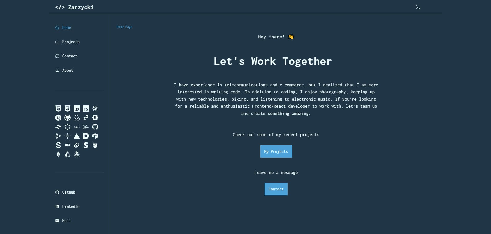
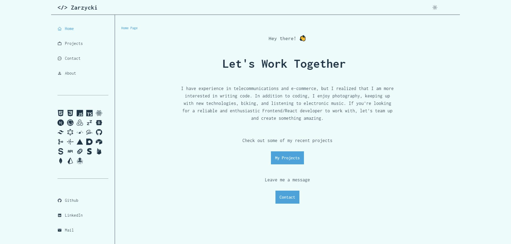

# Portfolio App - Next.js 14 + Typescript

Features:

- Tailwind design
- Dark mode + Local Storage using Zustand
- Zustand state management
- Typescript
- Static Site Generation (SSG)
- Framer Motion animations
- Sanity CMS integration
- Nodemailer with Gmail integration (server actions)
- React Hook Form + Zod Validation

##  [Visit project url](https://zarzycki.tech/)

  

  

